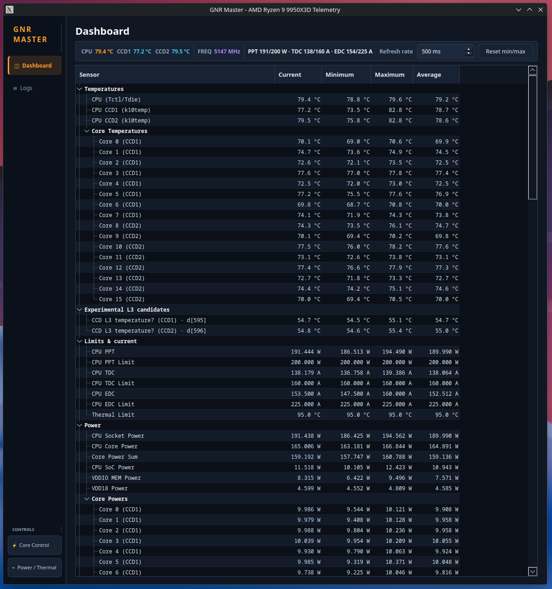

# GNR-SMU

Telemetry map and SMU control tools for AMD Granite Ridge (Zen 5) under Linux.

This is a fork of [Kyworn/gnr-smu](https://github.com/Kyworn/gnr-smu).

Telemetry and controls are supported on the Ryzen 7 9800X3D and Ryzen 9 9950X3D.
See the [9800X3D profile](docs/cpus/zen5/9800X3D.md) and
[9950X3D profile](docs/cpus/zen5/9950X3D.md) documentation for the supported telemetry and
controls.

On the 9950X3D, Ryzen Master and a direct live comparison establish
`d[349..364]` as the per-core clock lane in GHz. GNR Master uses this direct
PM-table value and does not fall back to Linux `cpufreq`. The remaining mapped
blocks retain conservative labels until independently validated.



The `ryzen_smu` driver exposes a model-specific PM table at
`/sys/kernel/ryzen_smu_drv/pm_table`, with no published layout. The 9800X3D table is
1828 bytes / 457 float32 values; the 9950X3D table is 2452 bytes / 613 values. This
repo contains the measured layouts and tools that select the correct profile.

## What this fork changes

- **Adds Ryzen 9 9950X3D support.** The original repo only supports the Ryzen 7
  9800X3D. This fork adds a full second hardware profile for the 9950X3D — PM table
  `0x620205`, all 16 per-core temperatures, and a model-specific SMU command
  allowlist; see [`docs/cpus/zen5/9950X3D.md`](docs/cpus/zen5/9950X3D.md).
- **Unified HWiNFO-style dashboard.** The GUI ([`tools/gui/gnr_master.py`](tools/gui/gnr_master.py))
  is a single sensor tree with current/min/max/average columns, replacing the older
  page-per-category layout. A live status bar shows CPU/CCD temperatures, peak core
  frequency, and PPT/TDC/EDC in one line.
- **Live CPU EDC value.** `d[64]` was identified as the EDC current candidate
  (idle ~7 A, tracks above TDC current under load) and is shown next to the confirmed
  EDC limit; see `research/recheck_edc.py`.
- **Actually verified the 9950X3D's "L3" candidates instead of trusting table
  position.** They were never confirmed to begin with — just assumed from where
  they sat in the table. Live per-CCD load tests (`research/recheck_l3.py`,
  `research/l3_specificity.py`, `research/l3_specificity_controlled.py`) checked
  which fields actually respond to their own CCD and to L3-cache traffic
  specifically:
  - `d[595]`/`d[596]` (now `ccd_l3_temperature`, renamed from the unjustified
    "diode temperature" guess) are CCD-selective and, in a core-temperature-matched
    test, heat up more under L3 cache-thrash load than under an equally-hot ALU-only
    load — real evidence of L3 coupling.
  - `d[611]`/`d[612]` and the candidate CCD power/VDDM fields (`d[589]-d[592]`) were
    found to be **not** CCD-selective under the same test and have been removed from
    the GUI rather than kept mislabelled.
- **GUI usability fixes:** larger/consistently-styled refresh-rate and reset-min/max
  controls, a "Dashboard" page that matches its sidebar entry, and a frequency summary
  that reports the highest core clock instead of an average across all cores.

## Wanted: a dump from any other Granite Ridge part


This is the one thing that would move the project forward, and it takes about ten
seconds. Any still-unmapped Zen 5 desktop chip — 9600X, 9700X, 9900X, 9950X, or a
different PM-table version:

```bash
sudo python3 tools/dump_table_full.py > my_dump.txt
```

Open an issue with that file and your exact CPU model. The dump tool works on
unvalidated hardware on purpose: it drops the labels and prints raw values, which is
exactly what is needed to compare layouts.

[@tpoechtrager](https://github.com/tpoechtrager) has since sent the first one, from a
9950X3D — see [Credits](#credits). It established how the 16-wide per-core arrays
shift. One more part still helps, particularly a non-X3D or a 12-core.

Why it matters: the complete labelled map still comes from the 9800X3D. Most of the
9950X3D's remaining 613-float table has not yet been identified, and another layout
would help distinguish stable family-level fields from model-specific positions.

The other open questions need a different lever rather than more data. Thirteen fields
have a narrowed domain but no identification, because under load every axis rises at
once and none of them separates cleanly; on Zen 5 the die's thermal constant is
sub-second, so decay timing cannot separate the power and thermal domains either. That
needs frequency varied at constant power, or fixed power at two ambient temperatures.
And there is no live EDC value anywhere in this table version — that one is closed, and
the search is written up as a negative result.

## Read this before running it on your machine

**The complete map was measured on exactly one machine:** a Ryzen 7 9800X3D,
8 cores / 1 CCD, PM table version `0x620105`. The 9950X3D has a separate 613-float
profile, and its 16-lane per-core temperature block was independently validated on
both CCDs. It does not claim that the complete 9800X3D map applies.

That matters more than it sounds, because the failure mode is silent. A different
table version moves offsets, but the bytes still parse as floats — so a GUI can show
plausible watts and degrees that are simply the wrong fields. A different core count
also changes the width and starting index of later per-core arrays.

So the tools check first ([`tools/hwgate.py`](tools/hwgate.py)) and refuse rather than
guess:

| | Validated hardware | Anything else |
|---|---|---|
| Telemetry display | profile-specific | stops, with the reason |
| CSV/JSON export | profile-specific | exits, does not write a file |
| SMU writes (limits, Curve Optimizer) | profile allowlist only | blocked |

If you hit the gate, send a dump rather than loosening it — the offsets would be wrong,
not missing.

## What is actually known

All 457 indices have a row in [PM_TABLE_MAP.md](PM_TABLE_MAP.md), but the rows carry
very different weight, and the confidence column says which is which:

- **Cross-validated (strongest).** 14 automated checks compare PM fields against
  independent sensors — `k10temp`, `amdgpu`, `cpufreq`, DDR5 nominal — or against
  stock spec. Tctl, per-core temperatures, per-core frequency, boost limit, Vcore,
  VDDCR_SoC, VDDIO_MEM, iGPU clock, C6 residency, and the PPT/TDC/EDC limits
  (162 W / 120 A / 180 A, exact) are in this group.
- **Structural.** Zone `0x000` is the classic Zen `(LIMIT, VALUE)` pair layout: PPT
  `0x008`/`0x00C` in watts, TDC `0x020`/`0x024` in amps, thermal `0x028`/`0x02C` in
  °C, EDC limit at `0x0FC`. Every real temperature in the table is direct °C — there
  is no encoding to undo.
- **Inferred.** Correlation and load response only. Treat as a hypothesis.
- **Known wrong, and left in the map as such.** Several fields once marked CONFIRMED
  were disproved; the rows now say what they are *not*. See
  [the honesty audit](PM_TABLE_MAP.md#honesty-audit-2026-07-30).

Open questions are tracked in [docs/TOFIX.md](docs/TOFIX.md); the EDC search is written
up as
[a negative result](PM_TABLE_MAP.md#edc_value--closed-negative-result-2026-07-30).

## Verifying the map

The map is not trusted on its word. [`research/audit_map.py`](research/audit_map.py)
parses `PM_TABLE_MAP.md` itself and asserts every mechanically checkable claim against
live hardware — static fields must not move under load, fields documented as zero must
read zero, documented mirrors must be bit-identical, and cross-validated fields must
match their system sensor within tolerance. It exits non-zero on any failure.

```bash
sudo python3 research/audit_map.py
```

It runs a stress load and takes a few minutes. Its first run found 11 genuine
documentation errors, including three "perfect mirrors" that differ on every read and
nine fields labelled energy accumulators that do not accumulate.

Two measurement lessons from building it are worth stealing if you write your own:

- **Read the external sensor before `pm_table`, not after.** The PM table read costs
  an SMU transfer that warms the die enough to show in the next sensor read — a
  +2.4 °C bias, larger than most things you would be validating.
- **Use medians over a window, and compare sensors sampled in the *same* window.**
  Occasional garbage sysfs reads wreck a mean, and a reading taken before or after the
  window is a different point on a thermal transient.
- **Wait for equilibrium, and prove it with two stable windows, not one.** A sensor
  disagreement of a few degrees is almost always cooldown, not calibration: after a
  stress load the `k10temp` − `d[11]` delta decays +7.3 → +1.0 °C over a couple of
  minutes and only then settles at +0.15 °C. Single instantaneous reads cannot tell
  that apart from noise — at idle `k10temp` alone swings 46.6 → 64.6 °C on background
  activity.

## Tools

All of them need the `ryzen_smu` driver loaded. Root is required for SMN reads and
SMU writes; when the GUI is started without root it shows a warning and hides the
direct-SMN sensors (Tctl/Tdie, CCD, IOD and PROCHOT/HTC), while PM-table telemetry
remains available.

```bash
sudo python3 tools/gui/gnr_master.py      # HWiNFO-style table: current/min/max/avg, cores, rails, L3
sudo python3 tools/gnr_master.py          # menu-driven CLI for limits and Curve Optimizer
sudo python3 tools/export_telemetry.py    # 5 JSON snapshots
sudo python3 tools/export_telemetry.py --csv
sudo python3 tools/export_telemetry.py --live 2   # append a CSV row every 2 s
sudo python3 tools/export_telemetry.py --temps    # all per-core temperatures once
sudo python3 tools/dump_table_full.py      # complete table; labels where mapped
```

SMU control uses profile-specific MP1 mailbox **message IDs** (not table offsets).
Power limits use `0x3E` PPT, `0x3C` TDC and `0x3D` EDC on both supported parts.
This repo asserted the reverse until 2026-08-26; `research/probe_tdc_edc.py` settled
the 9800X3D mapping by writing a value and reading back which limit moved, and the
9950X3D mapping was subsequently confirmed the same way. Curve Optimizer uses
`0x50`-`0x57` per core on the 9800X3D and `0x35` with CCD/core selection encoded in
the argument on the 9950X3D. It is write-only, so the tools cache applied offsets in
`$XDG_CONFIG_HOME/gnr_master.json`. The GUI also stores its sensor-table column order,
column widths, refresh interval and window size there.

`research/` holds the measurement scripts, one per question asked: `audit_map.py`
(the map's regression gate), `recheck_zone0.py` / `recheck_sweep.py` / `recheck_edc.py`
(the zone 0x000 correction), `hunt_edc.py` (the exhaustive EDC search),
`classify_unknown.py`, `profile_load.py`, `profile_demoted.py` and
`transient_demoted.py`. `smu_send.py` and `smu_advanced.py` are standalone MP1/RSMU
mailbox tools.

`dump_table_full.py` prints the whole table with each field's documented meaning and
confidence, read from `PM_TABLE_MAP.md` itself.

## Requirements

- Linux 6.10+
- The [`ryzen_smu`](https://github.com/amkillam/ryzen_smu) kernel module, loaded
- `python3-pyqt6` and `pyqtgraph`, for the GUI only

## Safety

Writing to the SMU mailbox can destabilise or damage hardware. Specifics that matter:

- **A wrong offset is worse than a missing one.** Reading the wrong field shows a
  wrong number; writing a limit *derived* from a wrong field pushes it into the SMU.
  That has already happened here once on the 9800X3D profile — its configured
  thermal limit was read as TDC and pre-filled the write dialog with an incorrect
  current value. Hence the hardware gate.
- **Both front-ends block message IDs `0x03`-`0x0D` and `0x10`** outright, and that
  should stay. `0x58`-`0x5D` freeze MP1 on this part; do not probe them.
- Stock limits are 162 W PPT / 120 A TDC / 180 A EDC on the 9800X3D and 200 W /
  160 A / 225 A on the 9950X3D. The reset paths select the matching profile.
- The supported X3D profiles use a 95 °C thermal ceiling. The value is read from
  the active PM table rather than hardcoded by the front-end.
- SMU settings are volatile — a reboot reverts everything to BIOS constraints. That is
  also your recovery path.

## Credits

[@tpoechtrager](https://github.com/tpoechtrager) sent the first PM-table dump from a
second Granite Ridge part (Ryzen 9 9950X3D, table version `0x620205`, 613 floats) and
opened [PR #1](https://github.com/Kyworn/gnr-smu/pull/1) mapping its per-core arrays,
validated across both CCDs against `Tccd1`/`Tccd2`. That PR also used the ZenStates MP1
command order, which disagreed with this repo's — and it turned out this repo was the one
that had never measured it. The correction is in
[docs/FINDINGS.md](docs/FINDINGS.md#4a-power-limits-mp1); the tools had been writing the
TDC box to EDC and back until then.

## License

MIT — see [LICENSE](LICENSE).
